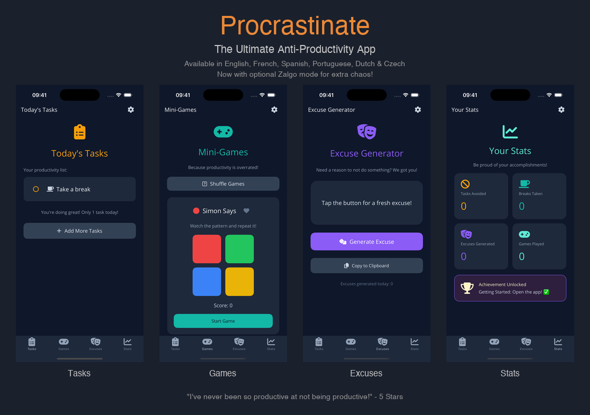

# 🦥 Procrastinate

**The Ultimate Anti-Productivity App**

Why be productive when you can procrastinate in style? This app helps you embrace your inner sloth with a full suite of tools designed to help you avoid work.



## ✨ Features

- **📋 Tasks** - Track all the things you're definitely going to do... later
- **🎮 Mini-Games** - 9 addictive games including Simon Says, Minesweeper, Tic Tac Toe, Snake, and more! Favorite your best games for priority shuffling
- **🎭 Excuses** - Generate creative excuses for why you didn't finish that thing (with optional AI-powered generation via Groq)
- **📊 Stats** - View your procrastination statistics and feel accomplished about doing nothing
- **♿ Accessibility** - High contrast mode for better visibility
- **⚙️ Settings** - Customize your procrastination experience

## 🌍 Available in 6 Languages

Procrastinate like a local! The app is fully translated in:

| Language | Flag |
|----------|------|
| English | 🇬🇧 |
| Français | 🇫🇷 |
| Español | 🇪🇸 |
| Português | 🇧🇷 |
| Nederlands | 🇳🇱 |
| Čeština | 🇨🇿 |

## 🤖 AI-Powered Excuses (Optional)

The app can generate creative excuses using AI! Two modes are available:

- **Random** (default) - Uses built-in random excuse templates (no API key needed)
- **AI (Cloud)** - Uses Groq's free API for more creative, context-aware excuses

### Setting up Groq API

1. Go to [Groq Console](https://console.groq.com/) and sign up for a free account
2. Navigate to **API Keys** in the left sidebar
3. Click **Create API Key** and give it a name (e.g., "Procrastinate App")
4. Copy the generated API key (it starts with `gsk_`)
5. Open the Procrastinate app Settings (gear icon)
6. Select "AI (Cloud)" for Excuse Mode
7. Paste your Groq API key in the API Key field
8. Enjoy AI-generated excuses!

The app uses Groq's `llama-3.1-8b-instant` model which is fast and free (with generous rate limits).

## 🛠️ Built With

- [.NET MAUI](https://dotnet.microsoft.com/apps/maui) - Cross-platform framework
- [Groq](https://groq.com/) - Fast AI inference (optional)
- [GitHub Copilot CLI](https://githubnext.com/projects/copilot-cli) - AI pair programmer that helped build this app
- C# - Because even procrastinators have standards
- FontAwesome - For beautiful icons

## 📱 Platforms

- iOS
- Android
- macOS (Catalyst)

## 🚀 Getting Started

```bash
# Clone the repository
git clone https://github.com/StephaneDelcroix/procrastinate.git

# Navigate to the project
cd procrastinate

# Build and run (iOS)
dotnet build -f net10.0-ios -p:RuntimeIdentifier=iossimulator-arm64

# Build and run (Android)
dotnet build -f net10.0-android
```

## 📄 License

This project is licensed under the MIT License - see the [LICENSE](LICENSE) file for details.

---

*Remember: Procrastination is just the art of keeping up with yesterday.* 🦥
